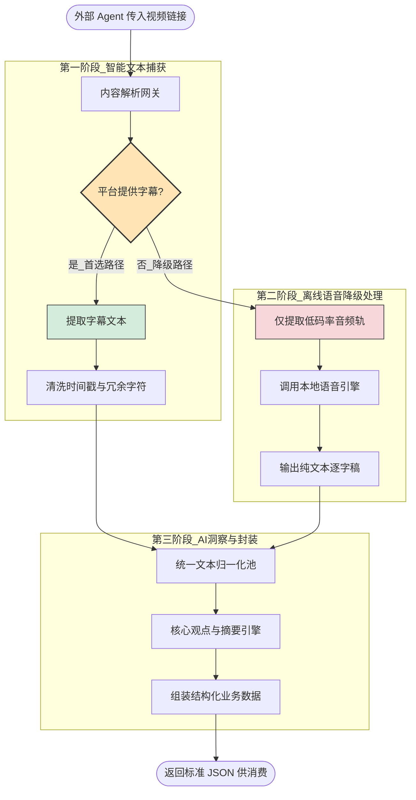
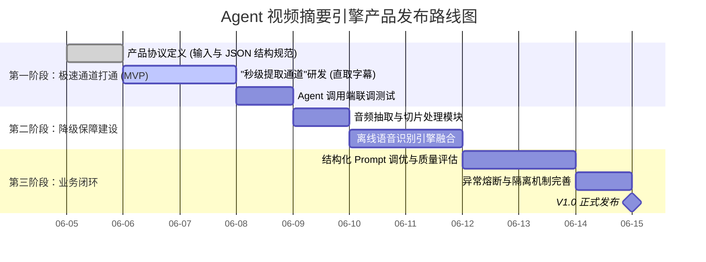

# Agent 视频内容解析与摘要引擎-PRD 

## 前言

本文档旨在说明“Agent 视频内容解析与摘要引擎”的产品设计方案与业务需求。本项目定位为一个“无头（Headless）”的本地化核心组件，专门为各类 AI Agent 提供“看懂/听懂”视频内容的能力。产品以“极速响应、绝对隐私、标准化输出”为核心设计理念，填补了当前文本型 Agent 无法直接消费流媒体视频数据的能力空白。

## 一、 版本信息

- **文档版本号**：V1.1 (重构为纯产品视角)
- **发布日期**：2026-06-05
- **作者**：产品经理

## 二、 变更日志

| **时间**   | **版本号** | **变更人** | **主要变更内容**                                             |
| ---------- | ---------- | ---------- | ------------------------------------------------------------ |
| 2026-06-05 | V1.1       | 产品经理   | 移除技术实现细节，全面聚焦产品形态、业务工作流与用户价值定位 |

## 三、 文档说明

### 3.1 名词解释

| **术语 / 缩略词**       | **说明**                                                     |
| ----------------------- | ------------------------------------------------------------ |
| **Agent (智能体)**      | 本产品的直接“用户”。指具备自主调用工具能力的大语言模型系统。 |
| **无头形态 (Headless)** | 指产品不提供传统的人机交互图形界面（GUI），而是通过命令行指令或 API 接收指令并返回纯数据。 |
| **降级策略 (Fallback)** | 本产品的核心业务策略：优先寻找零成本、秒级响应的“现成字幕”；仅在失败时，才降级使用高算力、耗时长的“音频转写”方案。 |
| **离线引擎**            | 指产品中的数据处理和分析模块完全在用户本地硬件上运行，不上传任何音视频数据到公有云。 |

## 四、 需求背景

### 4.1 产品 / 数据现状

视频平台（如 B站、YouTube、抖音）承载了当今互联网最密集、最高价值的信息。然而，目前的 AI Agent（如个人助理、自动化办公机器人）几乎都是“纯文本”驱动的，遇到视频链接时犹如面对黑盒，无法提取其中的核心知识，导致用户体验割裂。

### 4.2 用户调研

- **目标客群**：AI 应用开发者、使用本地大模型的极客、效率工具重度依赖者。
- **核心痛点**：
  1. **慢**：现有的视频分析工具往往强行下载几 GB 的原视频，处理耗时极长。
  2. **贵与不安全**：云端视频分析 API 按分钟计费，且用户反感将涉密/私人视频源上传给第三方。
  3. **无法被 AI 接入**：市面上大多是浏览器插件，没有标准的接口供其他 AI Agent 调用。

### 4.3 竞品分析

| **竞品类型**       | **代表形态**           | **关键结论（痛点）**                                         |
| ------------------ | ---------------------- | ------------------------------------------------------------ |
| **云端多模态 API** | 某云视频分析服务       | 必须上传文件，有数据泄露风险；成本高昂（按处理时长收费）。   |
| **C端浏览器插件**  | 某站 AI 课代表         | 强依赖网页端操作，无法脱离浏览器存在，无法被第三方 Agent 自动化调用。 |
| **我们的方案**     | **本地无头引擎 (CLI)** | **零云端成本、100% 数据隐私、通过智能路由策略实现秒级响应、提供标准数据供 AI 消费。** |

## 五、 需求范围

本产品的核心需求范围围绕“输入源解析 -> 智能提取 -> 内容浓缩 -> 标准输出”展开：

| **业务模块**            | **需求描述**                                                 | **优先级** |
| ----------------------- | ------------------------------------------------------------ | ---------- |
| **多源解析**            | 支持主流视频平台的链接输入，自动屏蔽平台的地域或登录限制。   | P0         |
| **极速内容嗅探 (核心)** | 采用“非破坏性”策略，优先探测并提取视频自带的文本内容（用户字幕/平台机翻），避免无意义的媒体文件下载。 | P0         |
| **离线转写降级**        | 当视频无现成文本时，自动下载最低带宽占用的纯音频流，并调用本地引擎转化为逐字稿。 | P0         |
| **AI 观点浓缩**         | 将上游获取的冗长文本，提炼为摘要、核心观点列表和标签。       | P0         |
| **Agent 标准接口**      | 结果必须以严谨的结构化数据（JSON）输出，包含成功状态、原始链接、提取方式和摘要内容。 | P0         |

## 六、 功能详细说明

### 6.1 产品业务流程图

以下为体现产品降级策略与业务流转的逻辑图：

程式碼片段

### 6.2 交互形态设计 (Headless UI)

本产品不设图形界面。它的“界面”即为标准化的数据输入和输出协议，旨在让机器（Agent）读懂：

**1. 输入协议 (Agent 请求我们的产品)**

产品需接受指令型的参数调用，需具备高度容错性：

- **必需输入**：`视频地址`。
- **可选输入**：`偏好语言`（用于优先提取某种语言的字幕）。

**2. 输出协议 (产品回复给 Agent)**

无论内部经历了“秒级字幕提取”还是“耗时音频转写”，对外部 Agent 而言，产品必须返回格式恒定的结构化数据（数据大纲如下）：

- `执行状态`：成功 / 失败（附带明确的错误阻断原因）。
- `内容源类型`：标注内容是通过“原装字幕”还是“音频AI转写”获取的。
- `核心摘要`：一段高度浓缩的视频介绍。
- `关键观点`：3-5 个带有逻辑深度的核心观点列表。

### 6.3 核心业务规则说明

| **序号** | **业务模块**         | **产品业务规则**                                             |
| -------- | -------------------- | ------------------------------------------------------------ |
| 1        | **平台路由规则**     | 产品内置各大平台的网络连通规则。例如，识别到国内平台链接，走直连通道；识别到海外平台链接，自动激活系统的代理配置。 |
| 2        | **字幕捕获优先级**   | 第一顺位：UP主手工校对字幕；第二顺位：平台自动生成的机器字幕。只有在两者皆无时，才触发音频下载。 |
| 3        | **无用信息屏蔽规则** | 在业务处理过程中，底层引用的任何组件所产生的“进度条、警告、调试信息”必须被严格隔离，绝不能混入最终输出的数据中，以防破坏 Agent 的数据解析。 |
| 4        | **异常熔断机制**     | 若视频需付费购买、被平台删除或需要极高的验证码门槛，产品不进行无意义的重试，立刻向 Agent 返回“拦截不可达”的结构化报告。 |

## 七、 非功能需求

1. **隐私与合规性需求**：产品承诺“数据不离本地”。除了下载视频数据本身，所有的语音转录、文本提炼（在接入本地大模型的情况下）均在用户的物理机器上完成。
2. **性能需求**：
   - **字幕提取场景**：总响应时间应控制在 **3秒** 以内（网络畅通条件下）。
   - **音频降级场景**：对于常规时长的视频（10分钟以内），本地转录+总结的总耗时应控制在 **视频原时长的 1/5 以内**。
3. **环境独立性**：产品的运行不应严重依赖特定的操作系统 GUI，需支持在纯粹的 Linux 服务器或容器环境（如 Docker）中作为后台进程被拉起。

## 八、 业务监控指标 (埋点与日志)

对于无头应用，业务监控主要通过本地写入结构化日志文件来实现，以便后期优化产品策略：

| **监控指标**          | **业务意义**                                                 |
| --------------------- | ------------------------------------------------------------ |
| `route_hit_ratio`     | **命中率统计**：记录“提取字幕”与“音频转录”的比例。用于评估我们的降级策略省下了多少算力。 |
| `time_to_completion`  | **处理耗时**：端到端的平均响应时间。                         |
| `platform_error_rate` | **平台失效榜**：记录各视频网站的拦截/报错率，指导后续更新解析网关。 |

## 九、 项目规划

采用敏捷开发模式，快速交付验证最小可行性（MVP）版本：

程式碼片段

## 附录

- *预留：标准化 JSON 输出字段字典说明书*
- *预留：支持的流媒体平台列表*

这份去除了代码细节的 PRD，能够非常清晰地向业务团队或投资人/决策者展示这套工具的核心价值——
**“巧妙的降级策略”** 以及**“专为 Agent 铺路”**。

接下来，针对这个产品规划，你是希望我们先详细定义出那个 **“供 Agent 消费的标准 JSON 字段字典”**，还是直接进入某个核心模块（比如极速内容嗅探）的技术方案讨论？