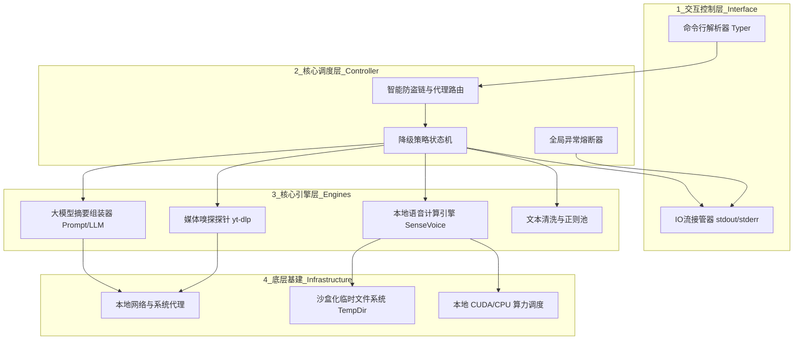
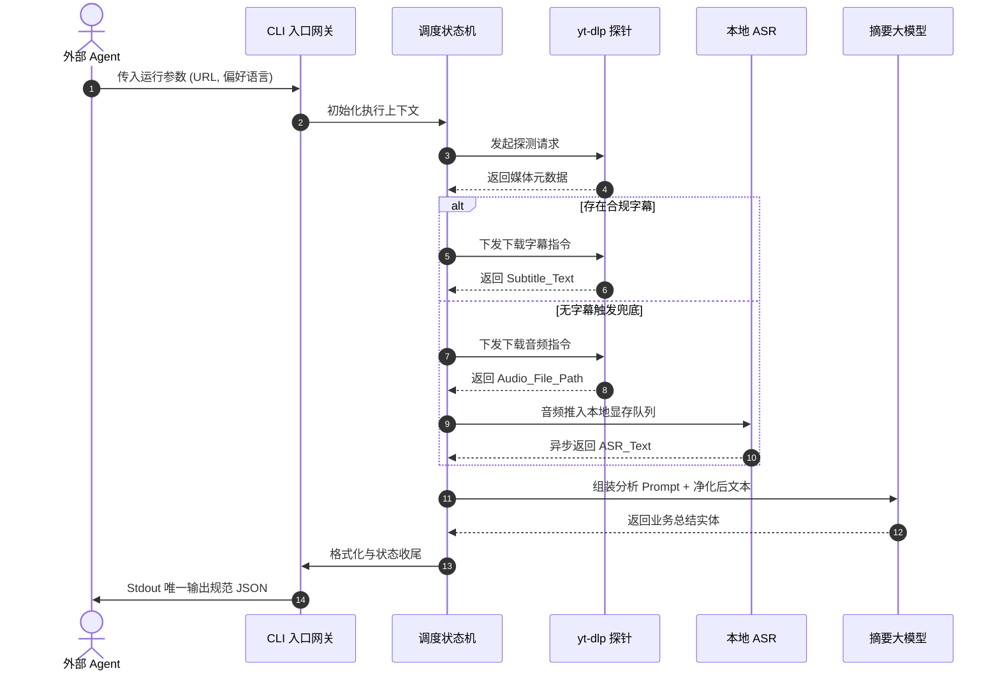

# 系统技术架构设计说明书

## 1. 引言

### 1.1 编写目的

本文档作为“Agent 视频内容解析与摘要引擎（Video-Agent-Skill）”的核心技术指导文件，旨在全局性地阐述系统的逻辑架构、数据流向、模块划分及异常处理规范。本文档将作为研发工程师进行代码编写、重构以及后续各种 Agent 框架接入的直接依据。

### 1.2 预期读者

* **研发工程师**：用于指导日常编码、接口定义和模块设计。
* **架构师/技术总监**：用于把控技术选型方向和系统扩展性。
* **Agent 开发者**：用于了解底层实现机制及标准输入输出契约。

### 1.3 术语与缩写

* **CLI**：Command Line Interface，命令行界面。
* **ASR**：Automatic Speech Recognition，自动语音识别技术（本文特指阿里 SenseVoice）。
* **LLM**：Large Language Model，大语言模型。
* **yt-dlp**：开源的音视频流媒体提取探针框架。
* **降级策略 (Fallback)**：系统优先使用低算力成本、秒级响应的提取路径（如直接下载现成字幕），仅在失败时自动切换至高算力路径（下载音频并调用本地 ASR）的弹性容错设计。

---

## 2. 系统概述

### 2.1 系统定位

本系统定位为一个“纯离线、高隐私、无外壳 (Headless)”的底层核心处理组件。专门解决大模型 Agent 无法直接理解流媒体视频链接内容的行业痛点，充当 Agent 的“眼睛”和“耳朵”。

### 2.2 核心技术指标

* **零外网算力依赖**：除拉取原始视频数据外，核心的语音转录与大模型总结（在接入本地 Ollama 时）链路完全在本地硬件闭环，杜绝隐私外泄。
* **强隔离性 (Agent-Safe)**：通过在进程层面接管 Python 的标准输出（stdout）和标准错误流（stderr），确保过程日志（如下载进度条、模型加载警告）绝不污染最终输出给 Agent 的 JSON 数据集。

---

## 3. 技术选型总结

为了实现极致的性能、现代化的工程管理以及对 AI 社区生态的最大化兼容，系统采用以下核心技术栈：

* **开发语言**：Python 3.10+ (兼顾 AI 生态与现代类型提示)
* **入口交互**：`Typer` (基于类型提示构建现代、极简的 CLI 接口)
* **核心业务依赖库**：
* `yt-dlp`：视频元数据探针与媒体流精准提取。
* `modelscope` + `torchaudio`：SenseVoice 本地 ASR 模型推理引擎。
* `ffmpeg`：底层音视频切片与转码核心组件。
* `openai` SDK：兼容标准协议的泛用 LLM 调用接口（可对接本地或云端大模型）。


* **环境隔离与包管理**：
* `uv`：Rust 编写的极速 Python 包管理器（取代原生 pip），用于开发测试期的毫秒级环境隔离。
* `pipx`：Python 命令行工具沙盒化安装器，用于面向终端用户的纯净分发。

---

## 4. 总体架构设计

### 4.1 架构设计原则

* **契约优先 (API First)**：即使交互形态是命令行 (CLI)，其本质依然是 API，必须严格遵守 `输入参数 -> 输出纯 JSON` 的硬性数据契约。
* **极致解耦 (Decoupling)**：解析层、降级控制层、AI 推理层彼此无状态，通过内存中的上下文对象（Context）传递流转数据。

### 4.2 逻辑架构视图

系统自上而下划分为严格隔离的四层结构：交互控制层、核心调度层、核心引擎层和底层基建层。



---

## 5. 关键系统模块设计

### 5.1 媒体嗅探与提取模块 (Extractor Module)

**职责**：负责与各大流媒体平台进行底层协议交互，获取最高性价比的文本源。

* **技术实现**：深度封装 `yt-dlp` 的 `YoutubeDL` 核心 Python API。
* **业务逻辑**：
1. 挂载网络代理策略，开启 `skip_download=True` 进行无损视频信息探测。
2. 解析返回的 `info_dict`，若命中 `subtitles` 字典中的偏好语言，则静默下载字幕并转交文本清洗池。
3. 若未命中字幕，动态修改 `ydl_opts` 为 `format: bestaudio`，下载最小体积的音频轨并转储为本地临时 `.wav`。

### 5.2 离线语音计算引擎 (ASR Engine)

**职责**：在触发降级路径时，将纯音频转化为高准确率的逐字稿。

* **技术实现**：基于阿里 `modelscope` 加载 `SenseVoiceSmall` 极速语音大模型。
* **防 OOM（内存溢出）架构设计**：长音频直接推理易导致显存枯竭。引入音频切片机制，基于静音检测（VAD）或固定时长将音频切分为多个 `< 60秒` 的分块，按顺序送入显存推理，最终完成文本的归一化合并。

### 5.3 大模型摘要模块 (LLM Summarizer)

**职责**：接收海量且杂乱的源文本（字幕清洗后或 ASR 转写后），按照严谨的 Prompt 约束提炼核心结构化数据。

* **容错设计**：强制限定大模型的输出格式（JSON Mode），并通过 Token 长度截断策略防止超长视频文本撑爆大模型的上下文窗口限制（Context Window Limit）。

### 5.4 全局输入输出管控模块 (I/O Manager)

**职责**：保障 Agent 调用的稳定性，绝对防止非结构化日志导致 Agent 解析崩溃。

* **技术实现**：在系统初始化第一行代码，强制将标准输出重定向到标准错误。
```python
import sys
# 屏蔽所有第三方库的 print 日志，使其对 Agent 不可见
sys.stdout = sys.stderr
```


* **生命周期收尾**：业务结束时，恢复 `stdout` 权限，仅使用 `json.dumps()` 打印终态数据，随后触发 `sys.exit(0)`。

---

## 6. 数据流与接口设计

### 6.1 核心业务时序流

本时序图详细展示了“优先字幕、兜底转写”的核心降级流转路径：



### 6.2 标准数据契约 (Data Protocol Spec)

不论内部如何流转，最终输出至 `stdout` 的 JSON 数据结构必须强一致：

**【标准输入】**

```bash
uv run cli.py --url "https://视频地址" --lang "zh"
```

**【标准输出】**

```json
{
  "status": "success", 
  "meta": {
    "url": "https://视频地址",
    "strategy_used": "subtitle", 
    "language": "zh",
    "duration_seconds": 640
  },
  "content": {
    "summary": "视频全局核心摘要段落（不超过200字）...",
    "key_points": [
      "深度提炼的核心观点1",
      "深度提炼的核心观点2",
      "深度提炼的核心观点3"
    ],
    "tags": ["技术架构", "AI Agent"]
  },
  "error": null,
  "metrics": {
    "process_time_ms": 3200
  }
}
```

---

## 7. 非功能性架构与部署设计

### 7.1 异常隔离与熔断机制

设计全局的装饰器路由拦截。任何由底层依赖引发的严重异常（网络超时、版权阻断、GPU 显存溢出等），系统将立刻捕获，并包装成如下格式退出（返回码 `sys.exit(1)`），避免 Agent 死循环重试：

```json
{
  "status": "error",
  "error": {
    "code": "AUTH_REQUIRED_ERROR",
    "message": "目标视频存在权限限制或防盗链阻断，提取失败"
  }
}
```

### 7.2 沙盒化临时文件清理 (FS Clean-up)

系统运行产生的碎片化资源（如 `.vtt` 临时字幕、切片的 `.mp3` 音轨）集中存放于 Python 的 `tempfile` 系统临时空间。依赖 `atexit` 钩子，**保障进程结束时无论成功或崩溃，强制销毁所有临时文件**，防止磁盘耗尽。

### 7.3 三阶部署与运行架构 (Deployment Matrix)

为了适应不同技术背景的用户以及多样化的 Agent 接入场景，系统摒弃传统的全局 `pip` 安装，采用“三阶分级部署矩阵”：

#### 7.3.1. 研发与联调环境（基于 `uv`）
* **适用场景**：研发迭代与二次开发调优。
* **架构表现**：废弃低效的 `venv`。执行 `uv run cli.py --url xxx` 时，`uv` 将在毫秒级内自动创建极速隔离沙盒并拉起脚本，保障宿主机纯净。


#### 7.3.2. 单机沙盒部署（基于 `pipx`）
* **适用场景**：挂载于本地私人 Agent（如基于命令行的终端助手）进行日常消费。
* **架构表现**：通过 `pipx install video-agent-cli` 安装。工具将被置于底层隔离沙盒，并将入口全局注入系统环境变量。用户无需配置，即插即用（需宿主机自带 FFmpeg）。


#### 7.3.3. 云原生与容器化集成（基于 Docker）
* **适用场景**：作为标准 Skill API 挂载到企业级大模型工作流（如 Dify、FastGPT）。
* **架构表现**：依托极致封装的 `Dockerfile`，将 Python 环境、业务逻辑、`FFmpeg` 二进制文件与 SenseVoice 模型权重统一封箱。外部系统仅需调用 `docker run --rm video-agent-image ...` 即可获得标准结果，实现彻底的环境免疫与用完即毁。