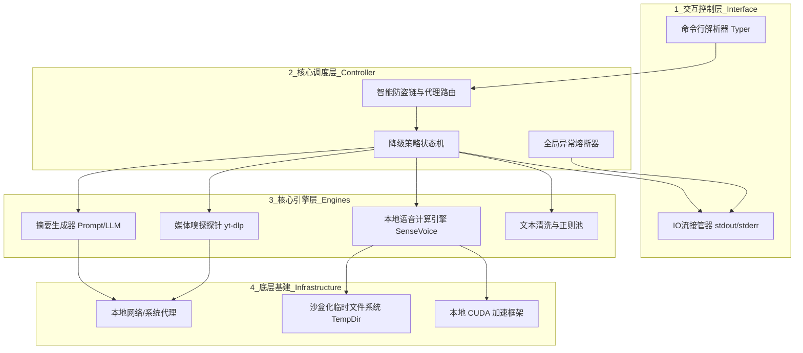

# Agent 视频内容解析与摘要引擎概要设计说明书

| 部 门： | 研发部 / AI架构组 |
| --- | --- |
| 编 写： | AI 架构师 |
| 审 核： |  |
| 批 准： |  |
| 日 期： | 2026年06月05日 |

**文档修订控制**

| **序号** | **版本号** | **修订日期** | **修订概述** | **修订人** | **审批人** | **备注** |
| --- | --- | --- | --- | --- | --- | --- |
| 1 | V1.0 | 2026-06-05 | 初始版本，基于产品需求说明书创建概要设计 | AI 架构师 |  |  |
| 2 | V1.1 | 2026-06-05 | 补充系统配置模块，增加智能代理路由与临时沙盒生命周期管理 | AI 架构师 |  |  |

---

## 1 引言

### 1.1 编写目的

为了解决文本型大模型 Agent 无法直接读取和理解流媒体视频内容的痛点，必须开发出一个纯本地化、高度隐私的视频解析 CLI 工具（Skill组件）。本文档旨在从宏观层面对系统的整体架构、核心功能模块、运行环境及数据流向进行概要设计，为后续的详细设计与编码实现提供标准规范。

### 1.2 目标及范围

本系统作为一个无头（Headless）命令行工具，范围包含：

- 主流视频平台（如 B站、YouTube 等）的 URL 智能解析。
- 视频自带字幕的极速嗅探与提取。
- 无字幕场景下的底层音频流拉取与离线语音计算（ASR）。
- 基于大语言模型（LLM）的结构化摘要提取。
- 标准化的 Agent 交互接口（标准输入输出隔离机制）。

### 1.3 参考资料
* 《Agent 视频内容摘要引擎 - 产品需求文档 (PRD) V1.1》
* 《Agent 视频内容摘要引擎 - 系统技术架构说明书 (TDD)》

### 1.4 定义及简写
* **CLI**: Command Line Interface，命令行界面。
* **ASR**: Automatic Speech Recognition，自动语音识别技术（本系统特指 SenseVoice）。
* **LLM**: Large Language Model，大语言模型。
* **yt-dlp**: 开源流媒体嗅探与下载探针。
* **降级策略 (Fallback)**: 优先低成本文本提取，失败则转为高成本语音识别的业务策略。

---

## 2 模块设计规则

### 2.1 系统运行环境
本系统定位于跨平台离线运行及容器化集成，不依赖传统 Web 服务器环境。

* **操作系统**：Windows 10/11, macOS, Linux (Ubuntu/CentOS 等)。
* **基础语言环境**：Python 3.10 及以上版本。
* **系统级依赖**：必须预装 `FFmpeg` 二进制组件（用于音视频切片处理）。
* **硬件建议**：具备 4GB 以上显存的独立显卡（如需流畅运行本地 ASR 推理），或采用 CPU 推理模式。
* **部署环境**：支持通过 `uv` 虚拟环境、`pipx` 独立沙盒或 `Docker` 容器执行。

### 2.2 系统结构图

系统整体采用层次化的设计，自上而下分为交互层、调度层、引擎层与基建层：



---

## 3 系统功能设计

### 3.1 媒体内容嗅探与提取 (数据获取)

该功能提供对输入 URL 的深度探测，以最优策略获取文本数据。

#### 3.1.1 极速文本捕获 (主动获取)

系统利用 `yt-dlp` 的 `skip_download=True` 参数获取目标视频的 `info_dict`。通过遍历元数据，优先寻找 `subtitles`（UP主精校字幕）或 `automatic_captions`（平台机翻字幕）。若匹配成功，直接静默下载字幕文件并交由清洗器提取纯文本。

#### 3.1.2 兜底音频拉取 (被动处理)

若极速文本捕获失败，状态机切换至降级模式。修改下载参数为 `format: bestaudio`，将最低码率的音轨下载至本地临时缓存目录，用于下一步的语音转写。

### 3.2 离线语音计算转写 (ASR)

针对下载的音频文件，进行本地化离线处理：

1. **静音切片 (VAD)**：为了防止显存溢出（OOM），调用 `pydub` 等音频处理库将长音频按照静音间隙切分为若干小段（如 30 秒片段）。
2. **算力推理**：加载本地 `SenseVoiceSmall` 模型，依次对音频片段进行转写。
3. **清洗整合**：过滤识别出的无意义语气词，合并为完整的长篇逐字稿。

### 3.3 大模型摘要与洞察 (LLM)

将完整文本组装入严谨的 Prompt 模板中。

* **支持双模式**：允许配置调用云端 API（如 DeepSeek、通义千问），或对接本地私有化大模型（如 Ollama + Qwen2.5）。
* **强制约束**：系统级别要求 LLM 采用 JSON Mode 输出，严格提炼“总体摘要”及“3-5个核心观点”，避免闲聊废话。

### 3.4 交互与数据流隔离管理

这是保障本系统能够作为 Agent 技能组件的核心设计。

* **日志隔离 (stderr)**：接管底层的控制台输出。将探针下载进度、模型加载警告等信息全部导向系统标准错误流 (`sys.stderr`)，实现对人可见、对大模型解析不可见。
* **数据契约 (stdout)**：业务执行完毕后，唯一且仅允许通过系统标准输出流 (`sys.stdout`) 打印一段符合约定的纯 JSON 字符串，供上层 Agent 捕获消费。

### 3.5 异常与熔断处理

建立全局的 Try-Catch 路由。在遇到以下情况时，停止重试，直接封装 JSON 错误信息并以退出码 `1` 结束进程：

* 视频被删、封 IP、代理失效（NetworkError）。
* 视频需要登录凭证或大会员权限（AuthError）。
* 显存溢出或切片异常（OOMError）。

### 3.6 系统配置管理

系统通过读取本地配置文件（如 `config.yaml`）或环境变量来进行灵活的参数初始化。核心配置项包含以下三大类：

#### 3.6.1 智能网络与分流代理配置 (Proxy Routing)

鉴于不同视频网站的网络连通性差异，系统设计了基于域名的规则路由机制：

* **多态代理池**：支持为不同的域名设置不同的代理服务器地址（支持 HTTP/SOCKS5 协议）。
* **直连白名单**：支持设置无需代理的域名列表（如 `bilibili.com`、`douyin.com`），命中白名单的 URL 将直连提取，最大化带宽利用率。
* **全局兜底**：当未匹配到特定规则时，可设置一个默认代理或默认直连策略。

#### 3.6.2 工作空间与资源生命周期配置 (Workspace & Lifecycle)

为了兼顾生产环境的磁盘安全与开发调试阶段的排错需求，系统将临时文件管理权限开放给配置文件：

* **自定义工作目录 (`temp_dir`)**：允许用户指定系统运行中产生的临时文件的存放路径。若留空，则默认使用操作系统标准的临时目录（如 `/tmp` 或 `%TEMP%`）。
* **自动化清理开关 (`auto_cleanup`)**：
* **开启 (True，生产环境默认)**：任务结束后，触发钩子彻底删除该任务产生的所有临时文件。
* **关闭 (False，开发/调试模式)**：保留下载的原始音频和切片文件，方便开发者查阅报错原因或进行本地大模型效果对比。

#### 3.6.3 AI 模型与算力配置 (AI Models)

* **大语言模型配置**：配置 LLM 的 `Base URL`、`API Key`，以及默认请求的模型版本。
* **ASR 算力配置**：指定 SenseVoice 加载的计算设备（`cpu`, `cuda`, `mps`）以及计算精度。

---

## 4 系统数据/存储设计

**设计说明：**
本系统属于纯粹的计算型和管道型工具，核心设计理念为“无状态（Stateless）”。因此，本系统**不使用任何持久化关系型数据库（如 MySQL、Oracle）**。所有数据流转基于内存缓存及标准的 JSON 数据结构。

### 4.1 核心数据交互协议 (JSON契约)

本 JSON 结构即为系统对外的核心“数据表”。每一次执行都必须返回该结构：

```json
{
  "status": "success", 
  "meta": {
    "url": "String - 请求的原始视频链接",
    "strategy_used": "String - 取值: subtitle / asr",
    "language": "String - 提取的文本语言类型"
  },
  "content": {
    "summary": "String - 不超过200字的视频概括",
    "key_points": [
      "String - 核心要点1",
      "String - 核心要点2"
    ],
    "tags": ["Array - 视频标签关键词"]
  },
  "error": {
    "code": "String - 异常代码（仅在status为error时存在）",
    "message": "String - 异常明细说明"
  }
}

```

### 4.2 临时文件存储与生命周期管理

系统运行过程中会产生大量媒体碎片，采用受控的沙盒化管理机制：

* **存储位置分配**：根据 `config.yaml` 中的 `temp_dir` 配置项，为每一次 Agent 调用生成一个带有独立 UUID 的子目录（例：`/自定义路径/agent_video_task_uuid/`）。
* **资源类型**：包含 `.vtt`/`.srt` (原始字幕文件)、`.m4a`/`.wav` (底层音轨流)、分块音频切片缓存。
* **销毁机制与策略路由**：
* 系统底层注入 `atexit` 与异常捕获钩子。
* 在进程即将退出前，读取 `auto_cleanup` 配置标识。
* 若标识为 `true`，则执行递归文件删除，释放宿主机磁盘空间；若为 `false`，则仅在标准错误流 (stderr) 中打印文件残留的绝对路径，供人工复核。


---

## 5 系统交互原型设计

鉴于系统形态为 Headless CLI 工具，不存在传统 GUI 界面，原型设计表现为命令行交互与回显模拟。

**【执行原形模拟】**

```bash
# Agent 在终端发起调用请求
$ uv run video-agent-cli --url "https://www.youtube.com/watch?v=sample" --lang "zh"

# 以下控制台滚动的过程日志，全部走 stderr，大模型自动忽略
[stderr] 2026-06-05 14:00:01 - [*] 正在解析视频元数据...
[stderr] 2026-06-05 14:00:02 - [*] 未找到直接字幕，降级触发音频下载...
[stderr] 2026-06-05 14:00:04 - [*] 下载完成，开始切片并唤醒 SenseVoice...
[stderr] 2026-06-05 14:00:10 - [*] ASR 解析完成，正在请求 LLM 进行内容浓缩...

# 最终程序退出前，打印以下纯净 JSON，走 stdout，Agent 捕获此内容
{"status": "success", "meta": {"url": "https://www.youtube.com/watch?v=sample", "strategy_used": "asr", "language": "zh"}, "content": {"summary": "该视频演示了...", "key_points": ["核心点A", "核心点B"], "tags": ["演示"]}, "error": null}
```

---

## 6 技术框架与组件栈

* **核心控制与生命周期**：Python 3.10+
* **命令行网关层**：`Typer` (基于类型提示的现代 CLI 构建器)
* **视频探针组件**：`yt-dlp` (支持超千个流媒体站点的解析)
* **语音推理引擎**：`ModelScope` + `torchaudio` + `SenseVoiceSmall` (阿里极速中文环境优化模型)
* **媒体底层处理**：`FFmpeg-python` (配合系统级 FFmpeg)
* **大模型通信组件**：`openai` SDK 兼容包
* **依赖隔离与打包分发**：`uv` (极速虚拟环境) / `Docker` (云原生容器化)

---

## 附录：核心配置文件 `config.yaml` 结构示例

```yaml
# 系统基础配置
system:
  temp_dir: "/var/cache/agent-video-cli"  # 自定义临时工作目录，留空则使用系统默认
  auto_cleanup: true                      # 是否在任务结束后自动删除临时文件

# 网络代理规则 (基于域名的前缀匹配或正则匹配)
network:
  default_proxy: null                     # 默认不走代理
  rules:
    - domains: ["youtube.com", "youtu.be"]
      proxy: "socks5://127.0.0.1:7890"    # 指定站点走特定本地代理
    - domains: ["vimeo.com", "x.com", "twitter.com"]
      proxy: "http://192.168.1.100:8080"  # 支持不同的代理通道
    - domains: ["bilibili.com", "douyin.com"]
      proxy: "direct"                     # 强制直连白名单

# AI 模型配置
ai:
  asr:
    engine: "sense_voice"
    device: "cuda"                        # 可选: cpu, cuda, mps
  llm:
    api_base: "http://127.0.0.1:11434/v1" # 默认指向本地 Ollama
    api_key: "sk-xxxx"
    model_name: "qwen2.5:7b"
    max_tokens: 2048

```