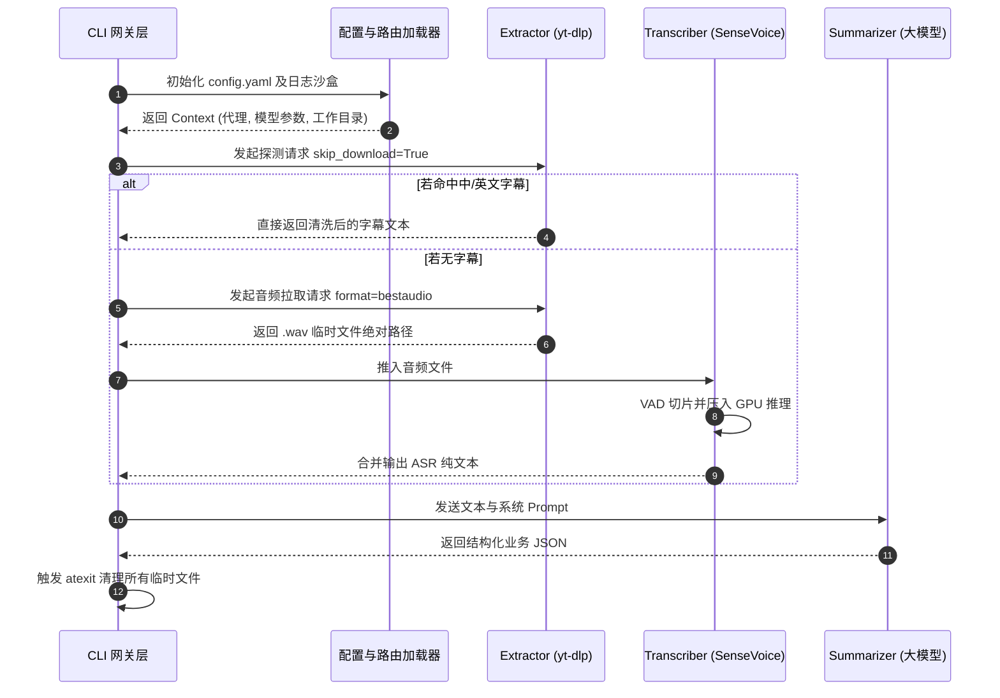

# Agent 视频内容解析与摘要引擎详细设计方案

## 1 概述

### 1.1 项目背景

目前各主流大模型 Agent 均以文本交互为核心，无法直接解析跨平台的流媒体视频链接。为打破数据交互壁垒，充分发挥大模型的总结分析能力，必须开发出一套底层无头（Headless）组件工具。本系统旨在实现视频内容的极速嗅探、离线语音转写及结构化数据输出，为上层 Agent 提供“看懂/听懂”流媒体的能力。

### 1.2 项目建设范围

本系统建设范围涵盖底层依赖封装、核心调度逻辑实现及交互接口规范，具体包括：

* **智能探测与提取模块**：基于 `yt-dlp` 实现多平台视频流及字幕的定向捕获。
* **离线语音计算模块**：集成 `SenseVoiceSmall` 模型，完成长音频的切片与精准转录。
* **大模型调度模块**：实现动态 Prompt 组装与大语言模型（LLM）的无缝对接。
* **工程化部署与配置体系**：实现基于 `uv`/`Docker` 的环境隔离、智能代理路由分发及临时文件沙盒管理。

### 1.3 术语定义

| 术语 | 定义 |
| --- | --- |
| **VAD** | Voice Activity Detection，语音端点检测，用于按静音区间切割长音频。 |
| **CLI 契约** | 系统在终端标准输出（stdout）中唯一允许返回的纯 JSON 数据格式规范。 |
| **降级策略** | 优先获取零成本文本（字幕），获取失败则退而求其次下载音频进行算力转录的策略。 |

---

## 2 设计原则

### 2.1 强隔离性原则

系统必须绝对保证内部运行日志、第三方库的进度提示与最终输出的业务数据实现物理层面的隔离，防止 Agent 解析崩溃。

### 2.2 离线优先原则

除了视频流媒体的下载和云端 LLM API 的调用（若配置为云端）外，核心的语音识别计算必须 100% 在本地显存/内存中闭环，保障极高的隐私安全。

### 2.3 适应性与弹性原则

系统必须能够适应海内外极其复杂的网络环境变化，提供灵活的代理路由表；并在遇到诸如显存不足、视频需权限等异常时，提供优雅的错误熔断和明确的错误码反馈。

---

## 3 架构详细设计

### 3.1 总体架构执行视图

系统采用管线式（Pipeline）调用链，核心执行时序如下：



### 3.2 部署架构设计

系统采用三阶部署架构，满足不同阶段的运行需求：

1. **研发测试层 (uv 环境)**：依赖项目根目录 `pyproject.toml`，通过 `uv run main.py -u [URL]` 毫秒级创建虚拟环境并运行。
2. **单机沙盒层 (pipx)**：通过 `pipx install .` 将依赖封箱至底层，对外仅暴露全局命令 `video-agent`。
3. **容器编排层 (Docker)**：依托 `Dockerfile`，采用多阶段构建，打包 Python 3.10、FFmpeg 二进制包及模型权重，体积控制在合适范围内，对外仅暴露执行入口。

---

## 4 核心模块详细设计

### 4.1 提取器模块 (Extractor) 设计

该模块深度封装 `yt_dlp.YoutubeDL` 类，避免使用 `subprocess` 调用命令行，从而捕获完整的 Python 字典对象。

* **配置注入**：读取 `config.yaml` 的网络路由规则，动态向 `ydl_opts` 注入 `proxy` 参数。
* **探测代码逻辑**：
```python
ydl_opts = {
    'skip_download': True,
    'quiet': True,
    'writesubtitles': True,
    'writeautomaticsub': True,
    'subtitleslangs': ['zh-Hans', 'zh-Hant', 'en'],
    'outtmpl': f"{temp_dir}/%(id)s.%(ext)s"
}

```


* **降级代码逻辑**：若解析 `info_dict` 发现无可用字幕，重新实例化对象并设置：
```python
fallback_opts = {
    'format': 'bestaudio/best',
    'postprocessors': [{'key': 'FFmpegExtractAudio', 'preferredcodec': 'wav'}],
    'quiet': True
}
```


### 4.2 语音计算引擎 (Transcriber) 设计

考虑到消费级显卡的显存限制（如 4GB/8GB VRAM），处理超过 1 小时的播客将导致 `CUDA Out Of Memory`。

* **VAD 切片算法**：
1. 使用 `pydub.silence.split_on_silence` 方法分析传入的 `.wav`。
2. 设置 `min_silence_len=500` (毫秒) 与 `silence_thresh=-40` (dBFS)。
3. 将音频切割为不超过 30 秒的内存块 (Chunks)。


* **模型加载与推理**：
调用 `modelscope` 管道加载 `SenseVoiceSmall`。强制设置推理精度为半精度浮点 `fp16` 以节约 50% 显存。
* **后置清洗**：正则过滤掉阿里模型默认带出的情感标签和无效语气词（如 `<|zh|><|NEUTRAL|>` 等标示符）。

### 4.3 摘要调度器 (Summarizer) 设计

负责调用大模型完成非结构化文本向结构化 JSON 的转换。

* **接口封装**：采用 `openai` 官方 Python SDK 规范，通过配置 `base_url` 切换底层的 Ollama 或通义/DeepSeek API。
* **Prompt 模板**：默认 prompt 文件已升级为中文撰写，包含详细字段规范、处理规则和输出示例。支持 `title`、`summary`、`key_points`、`detailed_content`、`tags`、`transcript_excerpt` 六个字段。`detailed_content` 按视频逻辑结构分 2-4 个小节输出。
* **参数约束**：
* 启用 `response_format={ "type": "json_object" }` 强制 JSON 输出。
* 设置 `temperature=0.3` 降低模型幻觉。
* 中文输出强制使用简体中文，禁止使用繁体中文。


---

## 5 数据契约与配置规范

### 5.1 CLI 终端隔离契约

系统入口 `main.py` 第一行必须执行强隔离指令：

```python
import sys
# 接管标准输出，保障底层依赖产生的 print 不污染大模型视线
sys.stdout = sys.stderr 

```

在业务生命周期最后一刻，通过独立的函数定向输出：

```python
def __render_agent_output(data: dict):
    # 绕过重定向，直接向底层文件描述符 1 (真实 stdout) 写入 JSON
    sys.__stdout__.write(json.dumps(data, ensure_ascii=False))

```

### 5.2 系统配置结构规范 (`config.yaml`)

| **顶级键** | **子键** | **数据类型** | **默认值/说明** |
| --- | --- | --- | --- |
| `system` | `temp_dir` | String | 留空则系统自动分配操作系统临时目录。 |
|  | `auto_cleanup` | Boolean | `true`。开启后在进程退出前强删临时文件。 |
| `network` | `default_proxy` | String | 默认全局代理（可为空）。 |
|  | `rules` | Array | 规则列表，形如 `{"domains": ["youtube.com"], "proxy": "socks5://..."}` |
| `ai` | `asr.device` | String | `cuda` (优先), `mps` (Mac), `cpu` (兜底)。 |
|  | `llm.api_base` | String | `http://127.0.0.1:11434/v1` (默认对接本地 Ollama)。 |

---

## 6 异常熔断与沙盒清理详细设计

### 6.1 全局异常映射表 (Error Codes)

系统采用 AOP (面向切面) 设计思想，在外层捕捉所有运行时错误，映射为以下标准 JSON 返回给 Agent，杜绝 Python 原生 Traceback 抛出：

| **错误码代码** | **触发条件** | **处理动作** |
| --- | --- | --- |
| `AUTH_REQUIRED_ERROR` | B站需大会员、YouTube视频为私有等防盗链拦截。 | `sys.exit(1)` 并返回提示，停止 Agent 盲目重试。 |
| `PROXY_TIMEOUT` | 网络连通性失败或解析目标域名超时。 | 读取 `config.yaml` 代理规则并报错。 |
| `CUDA_OOM_ERROR` | 切片异常导致显存击穿。 | `sys.exit(1)`。 |

### 6.2 临时工作空间 (Workspace) 生命周期

1. **创建机制**：每次调用通过 `uuid.uuid4().hex` 生成独立的工作子文件夹，防止高并发 Agent 调用造成的文件覆盖。
2. **销毁机制**：引入 Python 内置的 `atexit.register(cleanup_func)`。无论程序遇到 `sys.exit(0)` 正常退出，还是遇到未经捕获的致命中断（如用户按下 `Ctrl+C`），`cleanup_func` 必定执行，递归调用 `shutil.rmtree` 抹除工作子文件夹，实现 100% 的磁盘免维护。