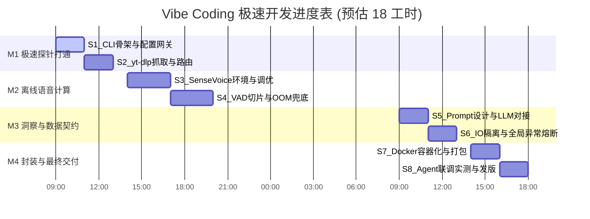

# Agent 视频内容解析与摘要引擎 - Vibe Coding 极速开发计划

| **部 门** | **研发部 / AI架构组**     |
| --------- | ------------------------- |
| **编 写** | AI 架构师 & AI 协同开发者 |
| **日 期** | 2026年06月05日            |
| **版 本** | V2.0                      |

## 1 引言

### 1.1 编写目的

本文档旨在为“Agent 视频内容解析与摘要引擎（Video-Agent-Skill）”提供基于 **Vibe Coding** 模式的极速开发路线图。通过 AI 编程助手（如 Cursor、Copilot 等）的深度介入，将传统需数周周期的项目，压缩至 **18 个核心工时（约 2-3 个工作日）** 内完成高质量交付。

### 1.2 核心开发理念 (Vibe Coding Mindset)

- **聚焦逻辑，让 AI 写模板**：开发者专注于业务状态机流转与异常兜底策略，所有 CLI 骨架、JSON 格式化、正则匹配等样板代码全部由 AI 一键生成。
- **错误驱动开发 (EDD)**：不花大量时间查阅底层 API 文档，先让 AI 给出初版代码，遇到报错直接将 Traceback 投喂给 AI 自动修复。
- **即时反馈闭环**：每个 Session 结束时，必须能在终端运行出一个可测试的中间结果，保持心流不断。

## 2 极速里程碑规划 (总计：18 工时)

项目划分为 4 个核心里程碑（Milestone），拆解为 8 个高度专注的开发区块（Session）。

程式碼片段

## 3 详细开发执行手册 (Session Breakdown)

### 🚩 M1: 极速探针打通 (预估 4 小时)

**目标**：跑通命令行参数解析，能成功从视频链接中静默下载出 `.vtt` 字幕或 `.wav` 音频。

- **Session 1: 基础设施搭建 (2 小时)**
  - **AI 提示词目标**：使用 `uv` 初始化 Python 3.10 项目；使用 `Typer` 生成带 `-u` (链接) 和 `-l` (语言) 参数的 CLI 入口；生成读取 `config.yaml` 代理规则的代码。
  - **人工介入点**：核对生成的目录结构，确保依赖包 `uv.lock` 正常生成。
- **Session 2: `yt-dlp` 核心逻辑 (2 小时)**
  - **AI 提示词目标**：编写 `extractor.py`。要求优先提取中英文字幕，如果 `info_dict` 无字幕，修改参数下载最低码率的 `.wav` 文件。
  - **人工介入点**：测试不同国内（直连）和海外（走代理）的视频链接，验证降级策略是否生效。

### 🚩 M2: 离线语音计算 (预估 6 小时)

**目标**：将下载的音频完美转换为纯文本，攻克显存溢出难题。

- **Session 3: 引擎唤醒与降维调优 (3 小时)**
  - **AI 提示词目标**：编写 `ModelScope` 加载 `SenseVoiceSmall` 的代码。强制要求 AI 在代码中加入 `fp16` 半精度推理参数以压缩显存。
  - **人工介入点**：在本地显卡上实际运行，观察显存占用峰值。
- **Session 4: VAD 切片与合并机制 (3 小时)**
  - **AI 提示词目标**：编写 `pydub` 音频切片脚本，按静音区间将音频切成 <30秒 的小段，按顺序送入模型识别，最后正则清洗语气词并拼接。
  - **人工介入点**：找一个长达 1 小时的视频音频进行压力测试，确保切片逻辑不会导致上下文断裂。

### 🚩 M3: 洞察与数据契约 (预估 4 小时)

**目标**：接入大模型，完成业务闭环，并实现专为 Agent 设计的“隐身”机制。

- **Session 5: LLM 对接与强结构化 (2 小时)**
  - **AI 提示词目标**：使用 `openai` SDK 编写 `summarizer.py`，支持对接本地 Ollama。注入 Prompt，启用 `JSON Mode`，强制返回特定的字段格式。
  - **人工介入点**：调试 Prompt，确保大模型不会在 JSON 外围输出多余的“好的，这是你的总结”等废话。
- **Session 6: IO 强隔离与熔断拦截 (2 小时)**
  - **AI 提示词目标**：在 `main.py` 顶层重定向 `sys.stdout` 到 `stderr`；编写全局 Try-Catch 装饰器拦截所有崩溃，转化为标准 JSON 错误输出；编写 `atexit` 钩子强删临时沙盒。
  - **人工介入点**：故意制造断网、显存不足等异常，验证终端是否能完美输出纯净的 JSON 报错信息。

### 🚩 M4: 封装与最终交付 (预估 4 小时)

**目标**：脱离开发环境，实现开箱即用的工业级分发。

- **Session 7: 云原生容器化构建 (2 小时)**
  - **AI 提示词目标**：编写精简版的 `Dockerfile`。要求内嵌 Python、FFmpeg 二进制依赖，并预先缓存 SenseVoice 模型权重。
  - **人工介入点**：执行 `docker build`，优化镜像层缓存，压缩最终体积。
- **Session 8: Agent 联调实测与收尾 (2 小时)**
  - **AI 提示词目标**：辅助编写 README.md 的工具使用说明（给 Agent 看的系统提示词）。
  - **人工介入点**：将该工具作为 System Tool 挂载到 Claude Code 或自研大模型工作流中，输入自然语言指令进行最终的 End-to-End 验收测试。

## 4 Vibe Coding 提示词 (Prompt) 最佳实践规范

为了在接下来的开发中让 AI 助手一次性生成高质量代码，建议采用以下结构向 AI 提问：

1. **设定角色**：“你是一个精通 Python 3.10、`Typer` 和多线程处理的资深架构师。”
2. **给定上下文**：“我们正在开发一个供 Agent 调用的无头视频分析工具，当前正在开发 [XXX 模块]。”
3. **明确约束**：“不要使用 print 输出任何业务无关的信息”、“强制捕获所有异常并返回字典”、“使用类型提示 (Type Hints)”。
4. **粘贴依赖**：“请基于附带的 `config.yaml` 结构和之前的 TDD 文档生成代码。”